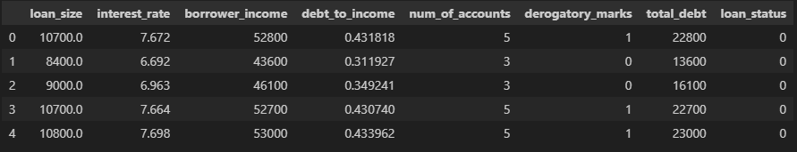
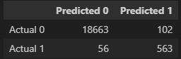
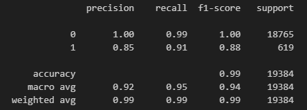

# credit-risk-classification
Module 20 Challenge

## ANALYSIS OVERVIEW

This challenge focused on analyzing lending data to train and evaluate a model based on loan risk. The dataset used for the analysis consisted of historical lending activity from a peer-to-peer lending services company, with a goal to identify borrowers' creditworthiness. The following steps were taken to complete this analysis:

1. The resources file was read into the notebook, and the data was split into labels (`y`) and features (`X`)

  

2. The data was split into training and testing datasets using the `train_test_split` module

3. A logistic regression model, using the `LogisticRegression` method, was used to initialize and fit the model using the training data

4. Predictions were then made on the model using the testing data

5. The model's performance was evaluated by creating a confusion matrix (first) and classification report (second)

  ### Confusion Matrix
   

  ### Classification Report
  

____________________________________________________________________________________

## RESULTS

* Healthy loans (`0`):
  * Accuracy: the accuracy of healthy loans was 100% or 1.00; this indicates the model correctly predicted each observation
  * Precision: the precision of healthy loans was also 100% or 1.00; this indicates that all instances where the model predicted healthy loans turned out to be true healthy loans
  * Recall: the recall of healthy loans was 99% or 0.99; this indicates that of the true healthy loans, 99% of them were correctly predicted to be healthy loans

* High-Risk loans (`1`):
  * Accuracy: the accuracy of high-risk loans was 88% or 0.88; this indicates the model correctly predicted 88% of the observations
  * Precision: the precision of high-risk loans was 85% or 0.85; this indicates that 85% of the instances where the model predicted high-risk loans turned out to be true high-risk loans
  * Recall: the recall of high-risk loans was 91% or 0.91; this indicates that of the true high-risk loans, 91% were correctly predicted to be high-risk loans

____________________________________________________________________________________

## SUMMARY

Overall, this model performed very well in predicting both healthy and high-risk loans, with a combined accuracy of 99%.  Healthy loans saw better performance with an accuracy of 100%, while high-risk loans had a lower accuracy of 88%. See above `RESULTS` for more details. 

Because of the significant differences in volume, one consideration may to be increase the volume of high-risk loans to see if that improves the model's accuracy.  Healthy loan volume was 18,765, compared to high-risk loans, which only had 619. 

I would confidently recommend this model's use in identifying healthy loans, but would like to see the accuracy and precision increase on the high-risk loans before recommending the model for identification for those. 

I do believe the high-risk loan accuracy is high enough that the model could be used as a guideline for flagging possible high-risk loans, but I would not be confident in using this to identify high-risk loans in its current state.
